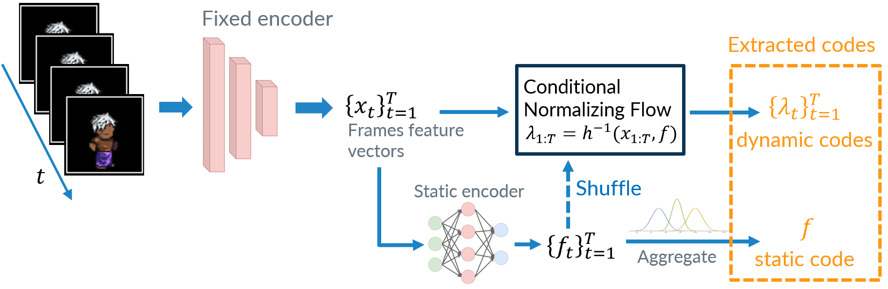

# Sequential Representation Learning via Static-Dynamic Conditional Disentanglement

## Overview


<div align=center></div>


This repository contains the implementation for the [Sequential Representation Learning via Static-Dynamic Conditional Disentanglement](https://www.arxiv.org/abs/2408.05599) paper which aims at self-supervised disentangled representation learning within sequential data, focusing on separating time-independent and time-varying factors in videos.


## Training and testing


The provided files allow to train from scratch and test the proposed method on the dSprites dataset as presented in the paper. To run the training process:
```
./train_and_test.sh
```


## Paper
```bibtex
@article{simon2024sequential,
  title={Sequential Representation Learning via Static-Dynamic Conditional Disentanglement},
  author={Simon, Mathieu Cyrille and Frossard, Pascal and De Vleeschouwer, Christophe},
  journal={arXiv preprint arXiv:2408.05599},
  year={2024}
}
```